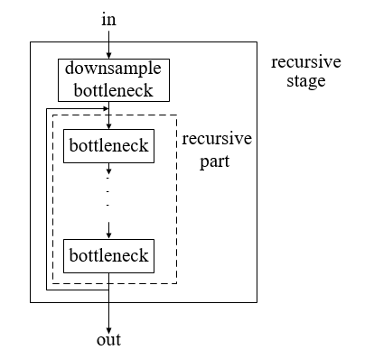
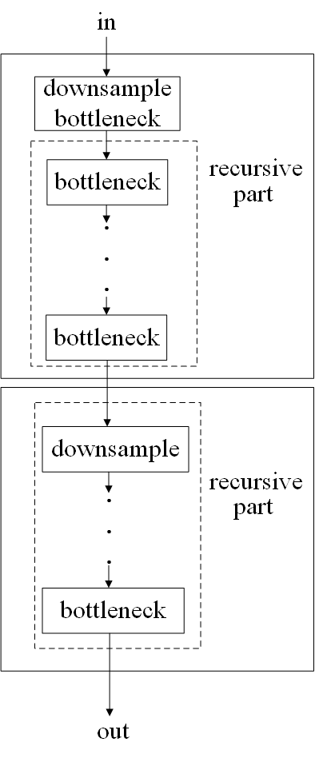
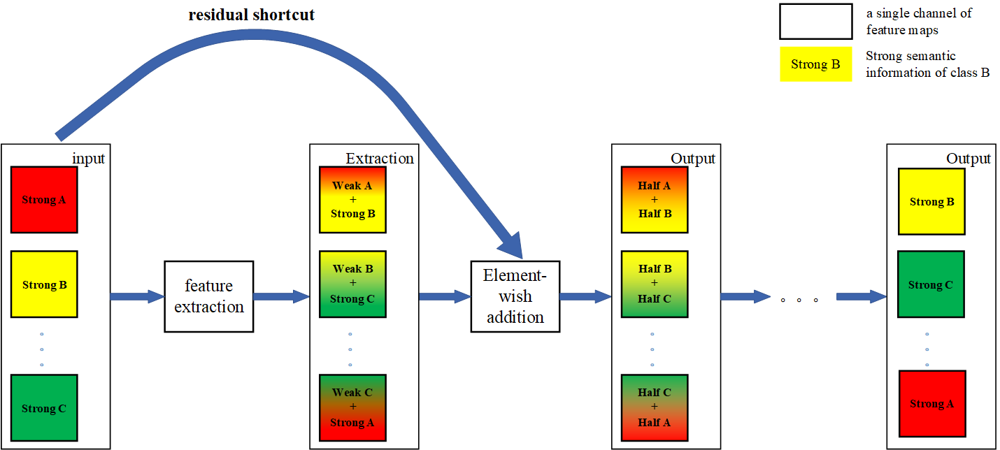
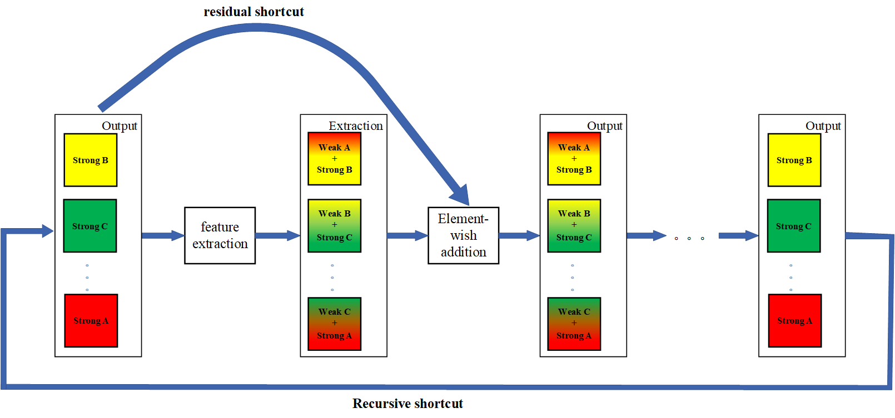

# SReResNet
SReResNet: Stage Recursive Residual Network. Enhancing semantic category information without extra convolutional layers.

## Updates
    Code is updating and trained models will be available soon.
    Paper will be available later.
    
### Installation 
[maskrcnn-benchmark](https://github.com/facebookresearch/maskrcnn-benchmark). The installation is the same as original maskrcnn-benchmark.
 
## Hardware Requirement
Only one Nvidia 1080 GPU is needed. (Specifically, I have only one 1080 at first.) 
And we observed higher AP on one 2080Ti.
Fix SOLVER setting is used like [here](SReResNet_on_FCOS/configs/fcos/fcos_R_50_FPN_1x.yaml) 
 
    SOLVER:
      BASE_LR: 0.0025
      WEIGHT_DECAY: 0.0001
      STEPS: (480000, 640000)
      MAX_ITER: 720000
      IMS_PER_BATCH: 2
      WARMUP_METHOD: "constant"

## Recursive shortcut

* [most concise code](SReResNet_pure_code/SReResNet_add_part.txt)

no need for extra convolutional layers! Just reuse the bottlenecks in recursive part via several lines.

Unrolling form of SReResNet.

## Diagram 
* ResNet.

The semantic information of each channel changes during forward propagation.

* SReResNet.

Use the output feature to keep the semantic information of each channel stable.

* Correlation.

SReResNet has much lower Self-correlation.
Self-correlation represents the Pearson Correlation Coefficient between different 
filters with a size of [input_channel, kernel_size, kernel_size] 
(corresponding to each channel) in one convolutional layer.
.png)

## Models
You can find some log files in "SReResNet_pure_code" which contain all configs and training details. 
SReResNet has about 1.2% AP higher than ResNet when using same configs.

The trained models of SReResNet-50 and SReResNet-101 are available here.
[download](https://pan.baidu.com/s/1brQv32FL1DM8Ibgdq2WKGw) (Verification code:2cur).