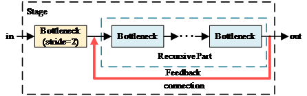
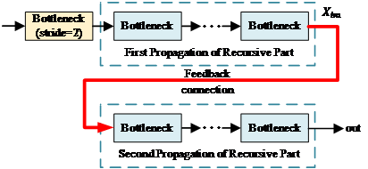
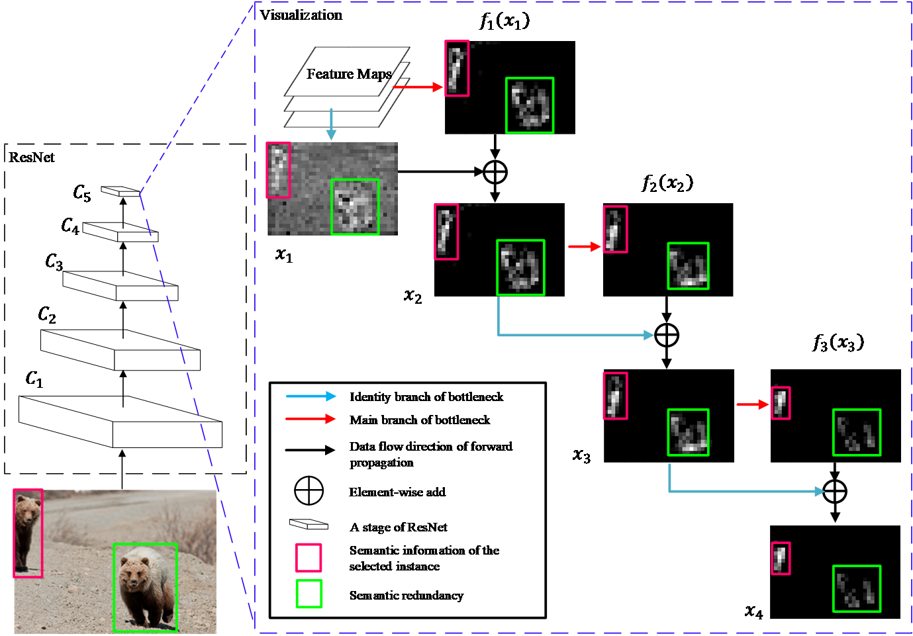
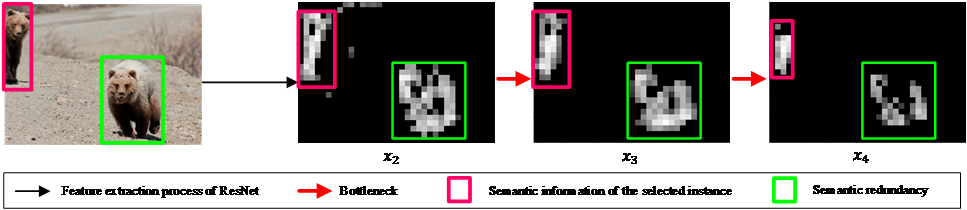
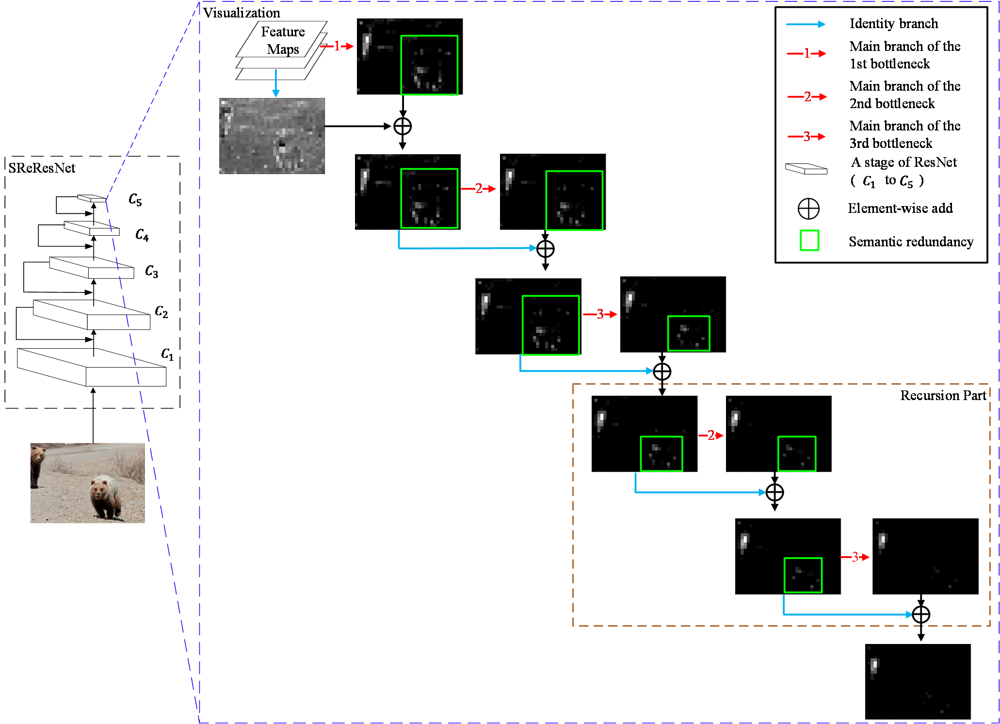
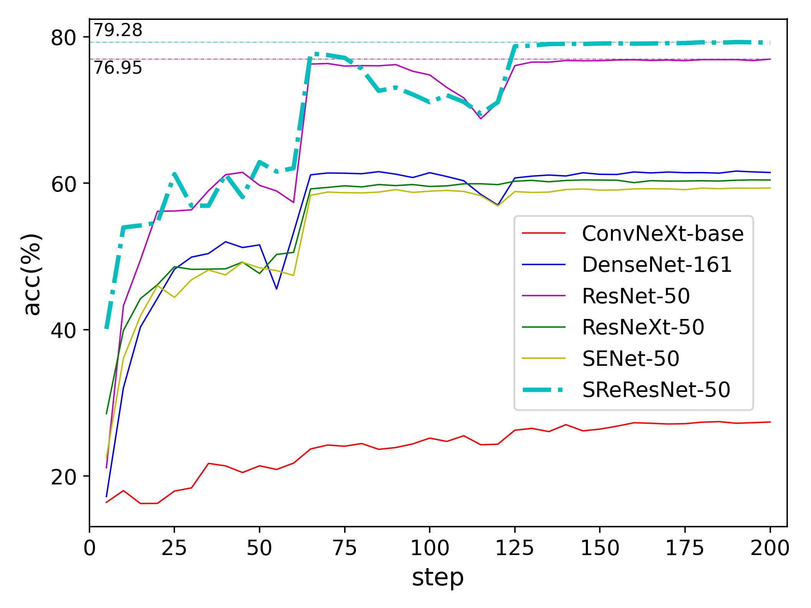
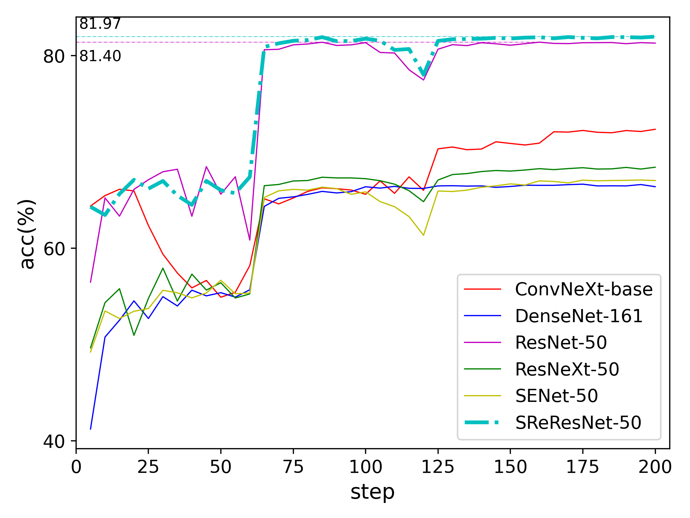

# SReResNet
SReResNet: Stage Recursive Residual Network. Enhancing semantic category information without extra convolutional layers.

## Updates
    2023/09/23: Code based on mmdetection is updated.
    
Paper is accepted by [EAAI](https://www.sciencedirect.com/journal/engineering-applications-of-artificial-intelligence)

We will update model zoo soon.
    

### Installation 
[maskrcnn-benchmark](https://github.com/facebookresearch/maskrcnn-benchmark). The installation is the same as original maskrcnn-benchmark.
 
Also, we provide another version based on [mmdetection](https://github.com/open-mmlab/mmdetection).
Only need to copy the subdirectory files of the fold [mmdet](mmdet) into your mmdetection project and follow the usage
of [mmdetection](https://github.com/open-mmlab/mmdetection).

## Hardware Requirement
Only one Nvidia 1080 GPU is needed.
And we observed higher AP on one 2080Ti.
Fix SOLVER setting is used like [here](SReResNet_on_FCOS/configs/fcos/fcos_R_50_FPN_1x.yaml) 
 
    SOLVER:
      BASE_LR: 0.0025
      WEIGHT_DECAY: 0.0001
      STEPS: (480000, 640000)
      MAX_ITER: 720000
      IMS_PER_BATCH: 2
      WARMUP_METHOD: "constant"

## Recursive shortcut

* [most concise code](SReResNet_pure_code/SReResNet_add_part.txt)

no need for extra convolutional layers! Just reuse the bottlenecks in recursive part via several lines.

Unrolling form of SReResNet.

## Diagram 
* ResNet.

The semantic information of each channel changes during forward propagation.

Despite the process of feature extraction tend to strengthen the semantic information of the instance
highlighted in red boxes while supress the other information, the output feature map (x4) contains strong
redundant semantic information of the instance highlighted in green boxes.

The evolution of semantic information:

* SReResNet.

The redundant semantic information of the instance highlighted in green boxes is suppressed well.

* Some results.

 

## Models
You can find some log files in "SReResNet_pure_code" which contain all configs and training details. 
SReResNet has about 1.2% AP higher than ResNet when using same configs.

The trained models of SReResNet-50 and SReResNet-101 (for [maskrcnn-benchmark](https://github.com/facebookresearch/maskrcnn-benchmark) ) are available here.
[download](https://pan.baidu.com/s/1brQv32FL1DM8Ibgdq2WKGw) (Verification code:2cur).

Trained models for [mmdetection](https://github.com/open-mmlab/mmdetection) is uploading~